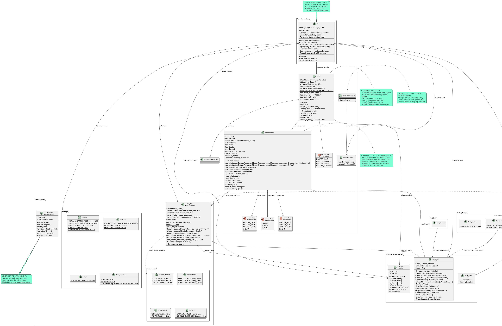

# Game from Scratch in C/C++ via Raylib and Box2D

## About

This is the git repository for a project about making a game from scratch, written in C and C++ powered by
[Raylib](https://www.raylib.com/index.html) ([Github link](https://github.com/raysan5/raylib?tab=readme-ov-file)) and
physics engine powered by [Box2D](https://box2d.org/) ([Github link](https://github.com/erincatto/box2d)).
<!--
[Bullet](https://pybullet.org/wordpress/)
([Github link](https://github.com/bulletphysics/bullet3)).
-->

## Running the Game

Use the `run.bat` file via typing `run` in console. There's nothing special about `run.bat`; it only acts as an alias
to the full path to the executable `build\lib\main.exe`.

## Compilation Notes

This project uses [CMake](https://cmake.org/) to build its files. Therefore, CMake is required to build this project.
All the build parameters and overall settings are written in `CMakeLists.txt`, and build presets are written in
`CmakePresets.json`. All CMake operations are done within the console, with this project's root directory as its
working directory.

Build files are required to build this project, and CMake will first need to configure those build files. To configure,
type `cmake --preset debug src -B build` in console.

The `--preset` command allows the user to choose which configuration or build preset should CMake use for this project.
This can range from determining which build generators to use (for this project it's `MinGW Makefiles`), to setting the
cache variables before reading `CMakeLists.txt`. In the case of this project, it's only used to specify which build
generator should CMake use, and the compiler flags for both debug and release build respectively.

Optionally, the `--fresh` argument should be used if `CMakeLists.txt` file was changed. The `--fresh` argument rewrites
the `CMakeCache.txt` file which stores various variables and their values between CMake runs.

After configuration, CMake can then build the project with the generated build files. To build, type in `cmake --build
build` in console.

In addition, if it is required to do a full clean of the build (basically deleting the whole `build` directory), the
command `cmake --build build --target full_clean` should be used. It uses the custom target made in `CMakeLists.txt`
file to delete the entire `build` directory to build this project from scratch. It may throw errors and the end of
command execution, which is an expected behaviour. One can then enter the configuration stage, and proceed from there.
One can also delete the `_deps` directory (the directory where this project's dependencies reside) via the target
`full_clean_dependency`.

common commands (for easy copy):

```
cmake --build build --target clean_install
cmake --build build --target full_clean
cmake --build build --target full_clean_dependency
cmake --fresh --preset debug . -B build
cmake --build build
```

## Development Notes

Overview of the architecture of this project can be illustrated by the diagram below:



More information can be found by opening the documentation under the `docs` directory. You must first generate the
`docs` directory with Doxygen by following the steps [here](#generating-the-documentation).

### Generating the Documentation

To generate this project's architecture diagram, [PlantUML](https://plantuml.com/) must be installed. Version
`1.2025.4` is used to generate the diagram. It is packaged as a `.jar` file, and be placed in this project's root
directory. To generate the diagram, type in the command below in command prompt:

```
java -jar plantuml-1.2025.4.jar architecture.puml -o docs
```

To generate this project's documentation, [Doxygen](https://www.doxygen.nl/index.html) must be installed. You can then
build the documentation files by entering the command below in command prompt with this project's root directory as the
working directory:

```
doxygen Doxyfile
```

The `docs` directory will then be modified, and Doxygen provides different forms of output to view the documentation.
For this project, a static HTML page will suffice, and can be accessed under:

```
docs\html\index.html
```

## Development Issues

Critical Bugs

3. State Management Never Used
    - Player starts in IDLE state and never transitions
    - MOVING and JUMPING states are empty in both animate() and draw() methods

Unused/Incomplete Systems

1. Multiple Physics Bodies
    - Player creates 3 physics bodies (one per animation state) but only uses the first
    - switch_to_body() method exists but never called after initialization
    - Entire body-switching system is unused

2. Camera Following
    - PlayerCameraController::follow() is empty (player_camera_controller.cxx:15)
    - Camera just moves right at fixed speed instead of following player
    - No actual player tracking logic

Missing Core Implementations

1. State Transition Logic
    - No detection of when to switch between IDLE/MOVING/JUMPING states
    - Missing velocity-based state detection
    - No ground detection for jumping mechanics

2. Animation System Completion
    - Only IDLE animation works
    - MOVING and JUMPING cases are empty
    - No model switching based on player state

3. Proper Game Mechanics
    - No ground detection system
    - No collision feedback
    - Limited jumping mechanics (just force application)

Recommendations

Immediate Fixes:

3. Implement basic state transitions based on velocity
4. Complete MOVING/JUMPING animation cases

Architecture Improvements:

1. Implement proper camera following with player position
2. Add ground detection for realistic jumping
3. Remove all Bullet physics references
4. Add resource loading error handling
5. Implement the body-switching system or remove unused bodies

The project has excellent architectural foundations but needs completion of core game mechanics to be fully functional.
